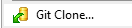

# Test_TopLevel_Repo
This repository is a repo of other repos, brought in as submodules.

## METHOD 1 TO CLONE - Command Line Interface
You will need [Git](https://git-scm.com/downloads)installed on your computer for this method.
1. Navigate to your desired local directory.
2. Open Git Bash in that location.
3. In Git Bash, enter the following `git clone https://github.com/RenesasMan/Test_TopLevel_Repo.git  --recurse-submodules`

## METHOD 2 TO CLONE
You will need [Git](https://git-scm.com/downloads), and then [TortoiseGit](https://tortoisegit.org/) installed on your computer for this method.
1. Navigate to your desired local directory.
2. Right click anywhere in the directory
3. Select 
4. In the URL field, type `https://github.com/RenesasMan/Test_TopLevel_Repo.git`
5. Check the **recursive** checkbox
6. Click **OK**